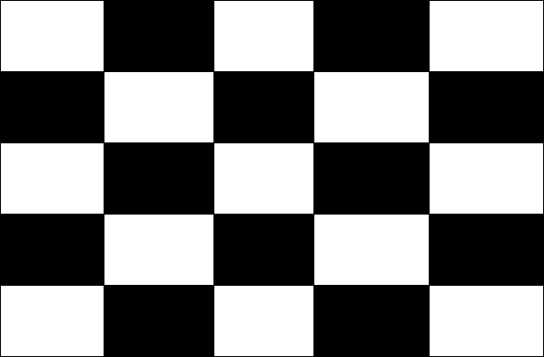

# Ein künstliches neuronales Netz lernt

Im letzten Abschnitt hat unser künstliches neuronales Netz für das Muster

entschieden das es zu `54%` ein gestreiftes Muster ist. Das ist zwar richtig, aber so wirklich darauf verlassen möchte man sich nicht.

i> Selbst 99% Genauigkeit wäre zu wenig. Stell dir vor es fahren 100 autonome Fahrzeuge über die Straßen deiner Heimatstadt. Stark vereinfacht kann man sagen, dass eins gleich einen Unfall bauen wird.

In diesem Abschnitt wollen wir nun lernen, wie wir das künstliche neuronale Netz so anpassen können, dass es sichere Entscheidungen trifft.

t> Arbeite die Schritte am besten gleich weiter mit. Dazu benötigst dazu das im letzten Schritt bereits ausgefüllte [Tabellenkalkulationsdokument](/knn/assets/convolutional_network.xlsx ':ignore') und kannst dann alle Schritte mitrechnen.

## Soll Zustand

In unserem Beispiel haben wir ein gestreiftes Muster als Eingangsmenge. Das ist zu 100% sicher, also eine `1,0`. Die anderen beiden schließen wir aus also `0,0`. 

## Kosten

Hö? Das hier kostet was? Nicht ganz: Insgesamt hat sich unser neuronales Netzwerk zu `0,41` vertan. Man sagt auch es sind Kosten in folgender Höhe entstanden: 

Die Werte kommen daher, dass wir den errechneneten Wert vom Sollwert abgezogen haben und beides ins Quadrat genommen haben. Also etwa `(0,54-1)^2` (Ja, da kommt `2,11` raus. Das liegt daran, weil wir unterwegs so viel gerundet haben). Damit erhalten wir zum einen einen positiven Fehlerwert und zum anderen werden die Fehler verstärkt. Dadurch werden große Fehler härter bestraft als mehrere kleine Fehler.

t> Warum ist es notwendig, das das Quadrat (`^2`) gebildet wird? Gibt es eine Alternative?

## Und wie lernt das künstliche neuronale Netz jetzt?!

Alles was wir eben einzeln gemacht haben, lässt sich ein eine einzige große Funktion packen. In dieser Funktion haben wir Variabeln. Nämlich die Werte aus dem Fully Connected Layer. 

Am Ende unser Funktion haben wir Kosten berechnet. Und diese Kosten wollen wir minimieren.

Was so einfach? Ja, so einfach. Eine kleine Funktion mit schlappen 30 Variabeln minimieren. 

In Mathe hast du sicher gelernt, dass man zum Bestimmen einer Variable immer eine Gleichung benötigt. Also bei 30 Variabeln auch 30 Gleichungen. Genau aus diesem Grunde werden wir hier auch raten. Raten? Jupp, was anderes bleibt uns ja nicht übrig. 

w> Bitte komm nicht auf die Idee, dass wir einfach 30 Bilder nehmen und damit 30 Gleichungen aufstellen müssten, die wir ja dann nach den 30 Variabeln auflösen könnten. Dies wäre nur in einer Welt möglich, wo unsere Gleichungen diese perfekt beschreiben. Da wir in unserem Modell aber vereinfachen mussten, sodass die Variabeln in den 30 Gleichungen nicht *exakt* aufgehen wird. Würden wir jetzt unser Modell auf die 30 Bilder optimieren, dass es alles *exakt* lösen könnte, dann würde an einem neuen Bild grandios scheitern. Dies nennt man overfitting.

Etwas professioneller: Mithilfe passender Heuristiken werden wir mit vertretbarem Aufwand die Kostenfunktion möglichst weit reduzieren, sodass uns das Ergebnis so zuverlässig erscheint, dass wir damit arbeiten können.

Bitte lass dich kurz auf folgendes Gedankenexperiment ein: Du bist ein Geograph und möchtest in einem großen Gebirge wie etwa den Alpen den niedrigsten Punkt erreichen. Im Idealfall hast du einen Helikopter und überfliegst die gesamten Alpen. Damit ermittelst du zielsicher den niedrigsten Ort. Da das aber zu aufwendig ist, lässt du dich einfach irgendwo in den Alpen absetzen und versuchst den niedrigsten Punk so zu finden: Du rennst natürlich einfach nach unten. Bist du ganz unten angekommen, könnte dies der niedrigste Punkt sein. Aber es könnte auch einfach nur ein hoch gelegenes Tal sein, und hinter dem nächsten Berg liegt ein viel tieferes Tal oder gar eine Schlucht. Daher bist du gezwungen, von dem Tal wieder aufzusteigen und noch einige andere Täler auszuprobieren. Anschließend kehrst du zu dem Tal mit den niedrigsten Punkt zurück.

So in etwa gehen die Algorithmen zur Minimierung der Kostenfunktion vor. Denn alle Täler können sie nicht besuchen, da dies nicht mehr berechenbar wäre.

Welche Täler man nun besucht und wie man überhaupt feststellt dass man in einem Tal und nicht schon wieder auf einem Anstieg ist, dazu gibt es verschiedene Heuristiken. Etwa läuft man besonders schnell, wenn man offensichtlich noch sehr weit oben ist und wird immer langsamer je näher man seinem vermeintlichen Ziel kommt.

t> Versuche das Abschneiden unseres Musters zu verbessern oder setze ein neues Muster ein. Du kannst dazu den Filter oder die Gewichte sowie den Bias verändern.

Bisher haben wir immer bekannte Bilder genommen und anhand diesen gelernt. Das ist nicht so geschickt, da wir so ja nicht wissen, wie gut unser künstliches neuronales Netzwerk mit neuen Bildern zurecht kommt. Daher sollten wir unsere bekannten Bilder aufteilen. Mit der ersten Hälft trainieren wir unser Netzwerk (suchen also ein möglichst tiefes Tal) und mit der zweiten Menge können wir im Anschluss prüfen, ob wir das gut gemacht haben. Klappt das bei der zweiten Menge nicht mehr haben wir vermutlich ein sogenanntes *overfitting* durchgeführt und müssen mit einem neuen Ansatz von vorn starten.

