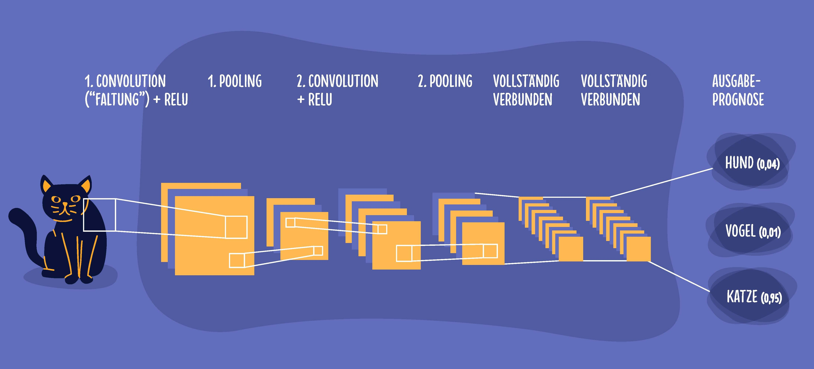

# Bilderkennung

Schauen wir uns genauer an, wie Bilder erkannt werden:

<figcaption>
Bild von [Iskender Dirik](https://id.vc/) und [Microsoft](https://news.microsoft.com/de-de/deep-learning-whitepaper/)
</figcaption>

Es werden folgende Schritte durchgeführt:

1. Convolution-Operationen: Der Hauptzweck eines Convolutionoder Faltungsschritts ist es, Merkmale aus den Eingabedaten zu extrahieren (z. B. Erkennen einer Kante). Während dieses Vorgangs wird das Bild von unterschiedlichen Merkmal-Detektoren gescannt, wodurch „Merkmalskarten“ entstehen. Man kann sich vorstellen, dass einzelne Merkmale sehr stark verstärkt werden und anschließend "Bilder" mit geraden und krummen Kanten exisitieren.
2. Rectified Linear Units (ReLU)-Operationen: Eine Convolution ist eine lineare Operation. Die meisten Daten in der realen Welt sind allerdings nicht linear. Wir werden hier ausgewählte Merkmale noch stärker betonen und andere ignorieren. Obowohl es komisch klingt sorgt das dafür, dass unser Neuronales Netzwerk robuster wird. Also etwa verschiedene Farbtöne ignoriert, aber gerade Linien für noch wichtiger hält (das tun wir übrigens auch).
3. Pooling-Operationen: Die Pooling-Operation reduziert die Dimensionalität. Man könnte auch sagen, wir verkleinern die sehr merkmalsintensiven Bildern. Je nach Anzahl der Schichten im Netz finden mehrere Convolution- und Pooling-Schritte statt, bis die letzte Schicht im Netz erreicht ist.
4. Klassifizierungsoperation: Die Klassifizierungsoperation (letzte Schicht) nutzt die erlernten Merkmale, um das Eingangsbild auf Basis des erlernten Datensatzes in verschiedene Klassen zu klassifizieren (z. B. Katzen und Hunde).

## Überblick über die Kapitel

Wir werden jetzt richtig ins Detail gehen und uns die Bilderkennung mathematisch ansehen. Da das sehr kompliziert ist werden wir keine Hunde und Katzen mehr, sondern nur noch Bildpunkte und Muster haben.

* [Wie entscheidet ein KNN?](fullyconnectedlayer.md) - hier schauen wir uns mathematisch an, wie ein Neuronales Netzwerk tatsächlich Entscheidungen trifft.
* [Daten für KNN vorbereiten](datenaufbereiten.md) - Lass uns unsere Daten aufbereiten, sodass wir mit ihnen arbeiten können.
* [Ein KNN entscheidet](entscheidung.md) - Hier lernen wir Muster zu erknnen.
* [Ein KNN lernt](lernen.md) - Wie kann man sich den Lernprozess (Backpropagation) vorstellen?