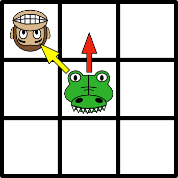
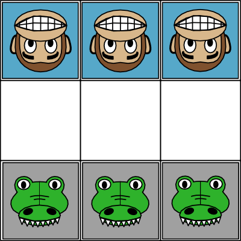

# Reinforcement Learning

## Schlag das Krokodil!

von [AI unplugged](https://ddi.cs.fau.de/schule/ai-unplugged/) unter CC-BY-NC

i> [Material-Download](https://ddi.cs.fau.de/schule/ai-unplugged/)
i> [Online ausprobieren](https://manzanillo.github.io/schlag-das-krokodil/)

Computer, die Schach spielen und Menschen schlagen können, kennen wir mittlerweile. Das chinesische Brettspiel Go hingegen galt lange Zeit als so komplex, dass nur Menschen es meistern können – so lange, bis Google mit Alpha Go menschliche Profi-Spielerinnen und Spieler das Fürchten lehrte. In dieser Aktivität sehen wir, wie Computer selbst Strategien für Spiele lernen,obwohl sie nur die Spielregeln kennen.

### Kontext

Wie lernen wir als Mensch ein Brett- oder Videospiel zu spielen? Vielleicht beobachten  wir  andere  beim  Spielen, vielleicht probieren wir aus, wie bestimmte Aktionen oder Spielzüge das Spiel beeinflussen. Je öfter wir gewinnen, desto besser werden  wir in einem Spiel. Wir entwickeln Strategien, mit welchen Zügen wir in bestimmten Spielsituationen am erfolgreichsten sind. Auf dieselbe Weise lernt auch ein Computer Spiele zu spielen.

 ### Ablauf

Das Spiel folgt einfachen Schachregeln: Jede Spielfigur bewegt sich wie ein Bauer, d. h. sie kann nur vorwärts gehen und gegnerische Figuren nur diagonal schlagen. Eine Schülerin bzw. ein Schüler übernimmt die Äffchen und agiert als menschliche Spielerin bzw. menschlicher Spieler. Eine andere Schülerin bzw. ein anderer Schüler übernimmt die Rolle des Computers in Form der Krokodile.

*Abb. 8: Mögliche Bewegungen einer* *Spielfigur*

Eine Seite hat gewonnen, wenn sie es schafft

* eine eigene Spielfigur an das andere Ende des Spielfeldes zu führen.

* alle gegnerischen Figuren zu schlagen.

* dafür zu sorgen, dass der Gegner in der nächsten Runde keinen Spielzug mehr ausführen kann.

*Abb. 9: Spielfeld vor Spielbeginn*

Zur Vorbereitung werden Ausdrucke der Zugmöglichkeiten des Computers vor der Spielerin bzw. dem Spieler, der die Krokodile übernimmt, ausgebreitet. Dann werden Schokolinsen (oder andere farbige Tokens) auf diese Zugmöglichkeiten verteilt. Dabei legen Sie für jeden farbigen Pfeil die entsprechende Farbe als Token in den Bereich rechts der gezeigten Spielsituation (siehe Abb. 11).

Die menschliche Spielerin bzw. der menschliche Spieler beginnt. Sie bzw. er kann sich frei gemäß der Spielregeln bewegen. Danach sind die Krokodile an der Reihe. Die Spielerin oder der Spieler vergleicht das aktuelle Spielfeld mit den Zugmöglichkeiten und wählt die passende Spielsituation aus den gegebenen Möglichkeiten aus. Zur schnelleren Orientierung ist jeweils angegeben, um welchen  Spielzug es sich handelt. In der ersten Runde müssen nur die beiden Möglichkeiten für Zug 1, in der zweiten Runde die 10 Spielzüge für Zug 2 und in Runde 3 die 7 Spielzüge für Zug 3 betrachtet werden. Dabei sind symmetrische Spiel- situationen nicht doppelt aufgeführt. Im Anschluss schließt sie bzw. er die Augen und zieht zufällig eines der neben der jeweiligen Spielsituation ausgelegten Tokens und verschiebt es auf die Zugvorgaben. Die Farbe des Tokens bestimmt, welcher Zug ausgeführt wird und   die   Spielerin   bzw.   der  Spieler bewegt die Spielfigur entsprechend des gleichfarbigen Pfeils. Wird beispielsweise ein rotes Token gezogen, wird das Krokodil dem roten Pfeil folgend bewegt.

 
*Abb. 10: Krokodil wird entlang des roten* *Pfeils bewegt*

Dieses Vorgehen wird solange wiederholt, bis die Siegerin bzw. der Sieger der Spielrunde feststeht. Bevor eine neue Runde gespielt wird, passt der Computer nun seine Strategie wie folgt an:

* Krokodile haben gewonnen: Ein Token in der Farbe des letzten, siegbringenden Spielzugs wird zusätzlich auf das Feld dieses Spielzugs gelegt.

* Äffchen haben gewonnen: Die Schokolinse, die den letzten Zug der Krokodil-Spielerin bzw. des Kro- kodil-Spielers bestimmt hat, wird entfernt. Die Spielerin bzw. der Spieler der Äffchen darf dieses ggf. essen.

Zudem werden alle Tokens wieder rechts vom jeweiligen Spielfeld platziert.

*Optional: Um die Regeln zu vereinfachen,* *können Sie die Verstärkung durch ein zusätzliches Token im Falle eines Siegs der Krokodile auch vernachlässigen.*

### Hintergrund

w> Der Abschnitt ist eigentlich nur für dein/e LehrerIn

Zunächst wird der Computer kaum eine Chance haben zu gewinnen, da er seine Bewegungen zufällig wählt (indem mit geschlossenen Augen ein Token  gezogen wird). Je mehr Spiele der Computer beendet, desto besser wird er: Er „lernt”, welche Züge ihm zum Sieg verhelfen und welche er vermeiden sollte,  da  sie  in  der  Vergangenheit  in einer Niederlage endeten. So wird die Strategie des Computers schrittweise verfeinert.

 Da der Computer für das Verlieren bestraft und für das Gewinnen belohnt wird, sprechen wir auch von *bestärkendem Lernen* (*Reinforcement Learning*) – ein Lernen durch Belohnung und Bestrafung:

* Bestrafung = Wegnehmen einer Süßigkeit bei einem Spielzug, der zur Niederlage führte

* Verstärkung = Hinzufügen einer Süßigkeit  bei  einem  Spielzug,  der zum Sieg führte

Durch dieses Vorgehen werden bei den jeweiligen  Spielzügen  diejenigen Züge „aussortiert”, die Niederlagen zur Folge hatten,   sodass   irgendwann nur noch „gute” Züge übrig bleiben. In der Praxis würde  man  Strategien,  die  nicht  zum Erfolg führen, nicht sofort eliminieren, sondern nur die Wahrscheinlichkeit ihres Auftretens verringern. So lernt die KI nach und nach, welche Strategie in welcher Situation wohl am besten geeignet ist, schließt einzelne Strategien, die nicht in jedem Fall zum Erfolg geführt haben, aber nicht sofort vollständig aus. Obwohl dieses Vorgehen im Spiel vereinfacht wird, indem Züge,   die   zur   unmittelbaren Niederlage geführt haben, sofort entfernt werden, kann nie der Fall eintreten,  dass  für  eine Spielsituation alle möglichen Züge eliminiert werden, da es für jede Situation mindestens eine Handlungsoption für den Computer gibt, die nicht zur sofortigen Niederlage führt.

Ein Computer kann auf diese Weise allein durch die Kenntnis der Spielregeln oder möglicher Eingaben lernen, ein Spiel zu gewinnen. Lernt ein Computer etwa das Videospiel *Super Mario* zu spielen,  wird  er  zunächst  nur  wahllos Eingaben tätigen. Das könnte dazu führen, dass er minutenlang nur stehen bleibt oder mehrfach in denselben Gegner hineinläuft. Er analysiert dabei die Objekte bzw. Pixel im Bild und reagiert mit Eingaben. Sein Ziel ist es, die erreichte Punktzahl im Spiel zu maximieren, die Punkte fungieren hier als Belohnung. Je weiter der Computer nach rechts vorrücken kann, desto größer fällt die positive Verstärkung aus. Mit der Zeit wird er so beispielsweise lernen, dass Springen seine Belohnung erhöht, wenn sich ein Gegner unmittelbar rechts von ihm befindet, da er durch das Überspringen des Gegners weiter im Level vorankommt. Auf diese Weise verbessert sich das Vorgehen eines KI-Systems in einem Spiel Stück für  Stück,  wobei  das  System  immer versucht,     seine     Belohnung     (oder genauer: eine bestimmte Funktion) zu maximieren.

Lassen Sie die Schülerinnen  und Schüler im Rahmen der Dekon- textualisierung analysieren, wie sich das Verhalten des Computers entwickelt. Es soll deutlich werden, dass der Computer durch Verstärkung von rein zufälligem Handeln zu einer effizienten Spielstrategie kommt. Im Anschluss kann beispielsweise mit Hilfe eines Videos zum Spiel *Super Mario* (siehe Website) gezeigt werden, wie das verstärkende Lernen in einem neuronalen Netz vonstatten geht. Lassen Sie die Schülerinnen  und Schüler hierbei insbesondere über die Grenzen der erlernten Strategien reflektieren. Sie können diese Aktivität sehr gut mit der Aktivität *Back to the Roots: Krokodil-Schach und klassische KI* kombinieren, um den Kontrast zwischen lernenden Systemen und klassischen KI-Anwendungen, wie regelbasierten Systemen, herauszustellen.
